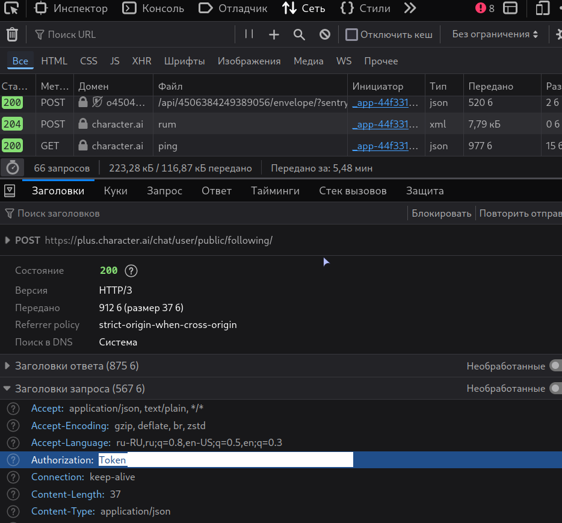
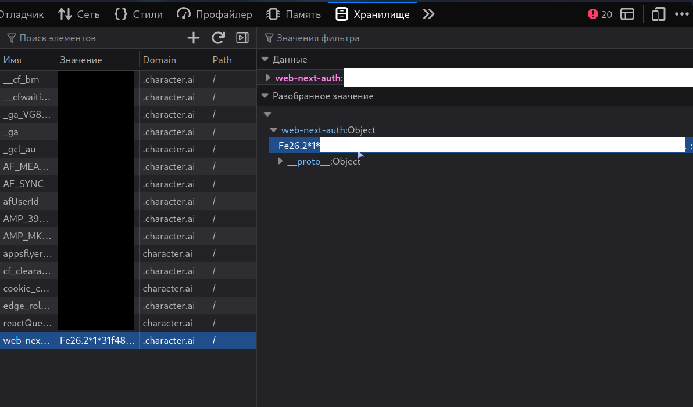

# Getting started

## Installation

```bash
pip install OpenCharAI
```

---

## Client setup

```python
from OpenCharAI import Client

client = Client()
```

Authenticate with your token:

```python
await client.authenticate("TOKEN")
```

If you need avatar upload support, also pass your `web_next_auth` cookie:

```python
await client.authenticate("TOKEN", web_next_auth="WEB_NEXT_AUTH")
```

Or use the convenience helper:

```python
from OpenCharAI import get_client

client = await get_client(token="TOKEN", web_next_auth="WEB_NEXT_AUTH")
```

---

## Getting your tokens

> [!WARNING]
> Never share your tokens. Anyone with them gains full access to your account.

This library uses two tokens:
- **`token`** — required for most API methods
- **`web_next_auth`** — only needed for `upload_avatar()`

### Quick method (recommended)

The fastest way is to copy both tokens at once from the browser console:

1. Go to [Character AI](https://character.ai) and **log in**
2. Open developer tools (`F12` / `Ctrl+Shift+I` / `Cmd+J`)
3. Go to the **Console** tab
4. Paste this and press Enter:

```javascript
copy({
  token: JSON.parse(localStorage.getItem('char_token')).accessToken,
  web_next_auth: document.cookie.match(/web-next-auth=([^;]+)/)?.[1] || ''
})
```

Your clipboard will contain both tokens. The first value is your main `token`.

### Alternative: Network tab

If the console method doesn't work:

1. Open [Character AI](https://character.ai) in your browser
2. Open developer tools (`F12` / `Ctrl+Shift+I` / `Cmd+J`)
3. Go to the **Network** tab
4. Interact with the site (visit your profile, send a message, etc.)
5. Click any request, find the `Authorization` header, and copy the value after `Token`



### Getting `web_next_auth` token only

1. Open [Character AI](https://character.ai) in your browser
2. Open developer tools (`F12` / `Ctrl+Shift+I` / `Cmd+J`)
3. Go to the **Console** tab
4. Paste and press Enter:
```javascript
copy(document.cookie.match(/web-next-auth=([^;]+)/)?.[1] || '')
```

Or find it in **Storage → Cookies** → look for `web-next-auth`.



---

## Core concepts

### Turns and candidates

A **Turn** represents a single message in a chat. Each turn contains one or more **Candidates** — alternative versions of that message (like when you swipe on the website to see a different reply).

The **primary candidate** is the currently selected version. When you send a message, you reply to the primary candidate. When you generate alternatives with `another_response()`, each new alternative becomes a candidate.

### Chat v1 vs Chat v2

The library supports two chat formats. **Chat v2** is the current standard and should be used for all new development. Chat v1 (`ChatHistory`, `HistoryMessage`) exists only for backward compatibility.

---

## Examples

### Basic chat

```python
import asyncio
from OpenCharAI import get_client
from OpenCharAI.exceptions import SessionClosedError

token = "TOKEN"
character_id = "ID"

async def main():
    client = await get_client(token=token)
    me = await client.account.fetch_me()
    print(f"Authenticated as @{me.username}")

    chat, greeting = await client.chat.create_chat(character_id)
    print(f"{greeting.author_name}: {greeting.get_primary_candidate().text}")

    try:
        while True:
            msg = input(f"[{me.name}]: ")
            answer = await client.chat.send_message(character_id, chat.chat_id, msg)
            print(f"[{answer.author_name}]: {answer.get_primary_candidate().text}")
    except SessionClosedError:
        print("Session closed.")
    finally:
        await client.close_session()

asyncio.run(main())
```

### Streaming

```python
answer = await client.chat.send_message(character_id, chat.chat_id, msg, streaming=True)

printed = 0
async for chunk in answer:
    if printed == 0:
        print(f"[{chunk.author_name}]: ", end="")
    text = chunk.get_primary_candidate().text
    print(text[printed:], end="")
    printed = len(text)
```

### Model types and output styles

```python
# Create a chat with the latest model:
chat, greeting = await client.chat.create_chat(
    character_id,
    model_type="MODEL_TYPE_DEEP_SYNTH_LITE"
)

# Create a chat with a specific output style:
chat, greeting = await client.chat.create_chat(
    character_id,
    output_style="creative"  # creative | balanced | precise | default
)

# Inspect the chat's model:
print(chat.preferred_model_type)
print(chat.model_preference_version)

# Set global defaults:
await client.account.set_model_preference("MODEL_TYPE_DEEP_SYNTH_LITE")
await client.account.set_output_style("creative")

# Read current settings:
pref = await client.account.fetch_model_preference()
style = await client.account.fetch_output_style()
```

A full runnable example is at [`docs/examples/simple_example_with_model.py`](examples/simple_example_with_model.py).

### Images

```python
# Generate images from text:
images = await client.utils.generate_image("a cyberpunk city at night")

# Upload an avatar (requires web_next_auth):
avatar = await client.utils.upload_avatar("path/or/url/to/image.jpg")
```

### Voices

```python
# Search voices:
voices = await client.utils.search_voices("friendly")

# Upload a voice clip:
voice = await client.utils.upload_voice("path/or/url/to/audio.mp3", "My Voice")

# Assign a voice to a character:
await client.account.set_voice("character_id", "voice_id")
await client.account.unset_voice("character_id")

# Generate speech from a chat message:
speech = await client.utils.generate_speech("chat_id", "turn_id", "candidate_id", "voice_id")
with open("voice.mp3", "wb") as f:
    f.write(speech)

# Or get just the URL:
url = await client.utils.generate_speech(
    "chat_id", "turn_id", "candidate_id", "voice_id", return_url=True
)
```

---

## Navigation

- [Welcome](welcome.md)
- **Getting started** ← you're here
- [Models](models.md)
- API Reference:
  - [Methods](api_reference/methods.md)
    - [Account](api_reference/methods/account.md)
    - [Character](api_reference/methods/character.md)
    - [Chat](api_reference/methods/chat.md)
    - [User](api_reference/methods/user.md)
    - [Utils](api_reference/methods/utils.md)
  - [Types](api_reference/types.md)
    - [Account / User](api_reference/types/user.md)
    - [Character](api_reference/types/character.md)
    - [Chat](api_reference/types/chat.md)
    - [Message](api_reference/types/message.md)
    - [Media](api_reference/types/media.md)
